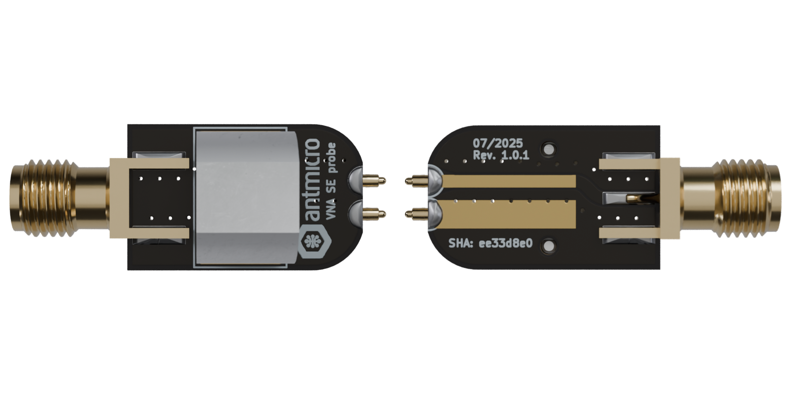

# VNA SE probe

Copyright (c) 2025 [Antmicro](https://www.antmicro.com)

## Overview

This project contains open hardware design files for a Vector Network Analyzer (VNA) Single Ended (SE) probe that can be used for VNA measurements on production PCBs, without the need to solder or add dedicated connectors.

### Design features

* SMA connector
* Controlled 50 Ohm impedance
* Compatible with M4 probe holder arms
* Compatible with pogo pins and measurement needles
* Probe pitch adjustable by soldering angle

## Project structure

The main directory contains [KiCad](https://www.kicad.org/) project files, a LICENSE and a README.
The remaining files are stored in the following directories:

* `img` - contains graphics for this README

## License

This project is licened under the [Apache-2.0](LICENSE) license.
